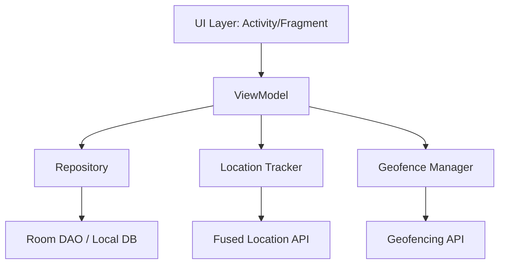

# GeoTrack App - Assignment Report

## 1. Introduction and Objectives
The GeoTrack Android application was developed to provide a seamless location tracking and geofencing experience. The primary objectives of this project were to:
- Track the user's current physical location using the GPS sensors.
- Allow users to drop pins (save locations) on a map and persist these locations locally.
- Implement geofencing around the saved locations so that the user receives an alert whenever they enter a 200-meter radius of the saved points.
- Provide a clear, easy-to-use user interface that follows Material Design principles.
- Offer live navigation directions from the user's current location to any of the saved points using external map applications.

## 2. System Architecture and Design
The application follows the **MVVM (Model-View-ViewModel)** architectural pattern. This ensures a clean separation of concerns, where the UI (Views) only observes data changes, the ViewModel handles business logic and UI state, and the Repository manages data operations.

### Components:
- **UI Layer**: Comprises `MainActivity`, `MapFragment`, and `SavedLocationsFragment`. It uses a Bottom Navigation View to switch between the map and the list of saved locations.
- **ViewModel**: `MapViewModel` exposes `LiveData` to the UI.
- **Repository Pattern**: `LocationRepositoryImpl` abstracts the Room database operations.
- **Local Storage**: `AppDatabase` built with Room to persist `SavedLocation` entities.

## 3. Implementation Details

### GPS Location Tracking
We utilized the **`FusedLocationProviderClient`** to track the user's location. The `LocationTracker` helper class sets up a `LocationRequest` with `PRIORITY_HIGH_ACCURACY` and a specific interval. 

### Geofencing API
Geofencing uses the **`GeofencingClient`**. 
- In `GeofenceManager`, we define a `Geofence.Builder()` to create circular regions (200m radius).
- We set the transition type to `GEOFENCE_TRANSITION_ENTER`.
- A `PendingIntent` is constructed to fire a `BroadcastReceiver`.

### Notifications
The `GeofenceBroadcastReceiver` intercepts the geofence transition. It uses the `NotificationManager` and `NotificationCompat.Builder` to alert the user. On Android 8.0 (API 26) and above, a dedicated Notification Channel ("GEOFENCE_CHANNEL") is created.

### Maps Integration and Navigation
- The UI integrates the **Google Maps SDK**.
- Saved locations are marked on the map with custom pins.
- Clicking a saved location in the list triggers an explicit Intent to Google Maps: `google.navigation:q=lat,lng` which routes the user automatically.

### Local Storage (Room Database)
- **Entities**: `@Entity` annotated `SavedLocation` and `CustomLocation` classes.
- **DAO**: `@Dao` interface outlining `insert()`, `update()`, `delete()`, and `getAll()`.

## 4. Screenshots of the App in Use
*(Embed your physical screenshots here before submitting to your lecturer)*
<!-- Note: Insert screenshots showing the Map, the List View, and a Notification Alert -->
1. **Map View**: Shows the user's blue dot and saved markers.
2. **List View**: Displays coordinates from Room DB.
3. **Notification Alert**: System notification when entering a geofence.

## 5. Challenges Faced and Solutions

### Background Location Restrictions in Modern Android
**Challenge**: Android 10 (API 29) and later introduced strict restrictions on fetching locations in the background, which broke the Geofencing alerts if the app was minimized.
**Solution**: We explicitly requested the `ACCESS_BACKGROUND_LOCATION` permission if the device is running API 29 or above, ensuring that Geofences can be monitored even when the application is not actively visible to the user.

### Updating Map UI Asynchronously
**Challenge**: The Map takes time to initialize (`getMapAsync`), and if the user's location is fetched before the map is ready, the UI could crash or drop the data.
**Solution**: We deferred any map interaction until `onMapReady` is fired by maintaining state in the `MapViewModel`. We only attach the location listeners when the Google Map bounds are fully initialized.
